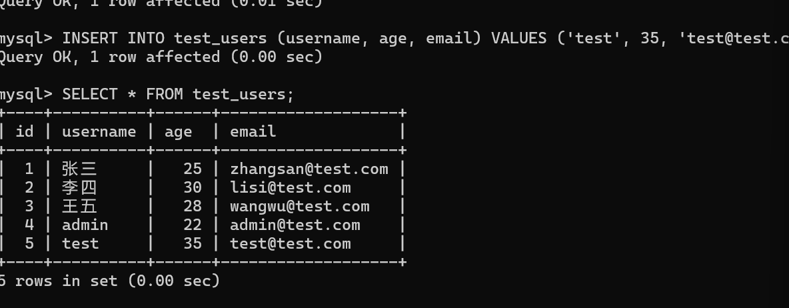

# MySQL 数据库练习 - Day 1

## 📌 项目简介
这是我的 MySQL 数据库学习计划的第一天任务。

## ✅ 今日完成内容
1.  **环境搭建**：在 Windows 上成功安装 MySQL Server 8.4.9（并排安装，端口 3307）。
2.  **建库与建表**：
    - 创建数据库 `test_db`
    - 创建表 `test_users`（包含 `id`, `username`, `age`, `email` 字段）
3.  **数据操作**：成功插入 5 条测试数据。
4.  **查询验证**：执行 `SELECT * FROM test_users;` 验证数据已落库。

## 📸 截图展示

## 💡 学习收获
- 熟悉了 MySQL 的安装与配置（特别是并排安装处理端口冲突）。
- 掌握了 `CREATE DATABASE`、`CREATE TABLE`、`INSERT`、`SELECT` 基础语句。